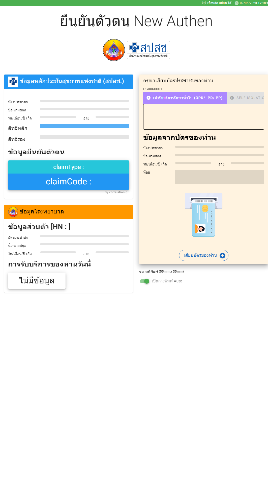

# Frontend Kiosk
API => https://github.com/dev-nirawit/kiosk_his_api_fastify_ts

MQTT อ่านบัตรประชาชน => https://github.com/dev-nirawit/moph-smartcard-reader


## Requirement

```
- nodejs v.16+
- nodemon or pm2
```


## Project setup

```
- #ติดตั้ง package
npm install

- # พัตณาระบบ หรือ เปิดใน mode development
npm run dev

- #Compiles production  โฟลเดอร์ /dist  แล้วนำไปรันบน server เช่น Nginx,Apache
npm run build

```


### Customize configuration

See [Configuration Reference](https://vitejs.dev/config/).
